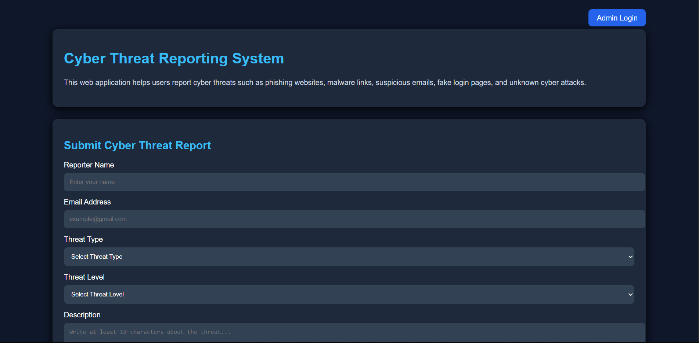
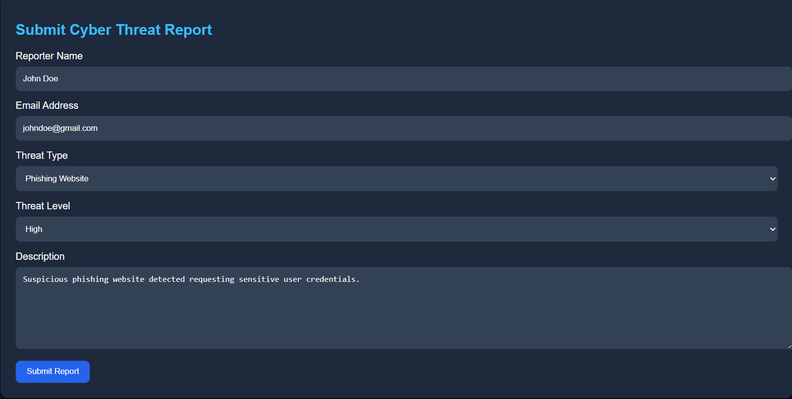
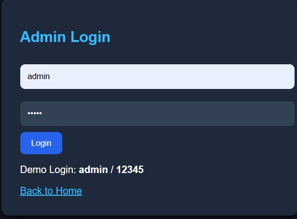
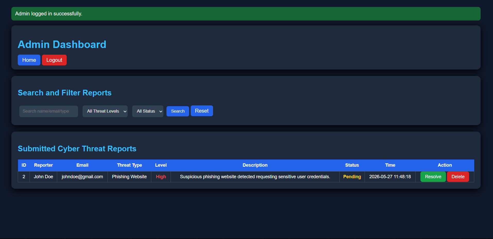

# 🔐 Cyber Threat Reporting System

A web-based **Cyber Threat Reporting System** developed using **Python, Flask, SQLite, HTML, and CSS** to help users report and manage cyber threats efficiently.

---

## 📌 Project Purpose

This system is designed to help users report cyber threats such as:

- Phishing Websites  
- Malware Links  
- Suspicious Emails  
- Fake Login Pages  
- Unknown Cyber Incidents  

The goal is to improve **incident tracking, cyber threat monitoring, and response management** through a simple and centralized web platform.

---

## 🚀 Key Features

✅ Cyber threat report submission  
✅ Secure admin login system  
✅ Threat severity classification  
✅ Search & filtering functionality  
✅ Pending/Resolved status tracking  
✅ SQLite database integration  
✅ Cyber incident management dashboard  

---

## 🛠️ Technologies Used

- Python  
- Flask  
- SQLite  
- HTML  
- CSS  

---

## 📸 Project Screenshots

### 🏠 Homepage


### 📝 Threat Report Submission


### 🔐 Admin Login


### 📊 Admin Dashboard


---

## ⚙️ How to Run This Project

### 1️⃣ Install Flask

```bash
pip install flask
```

---

## 👨‍💻 Developer

**Rifat Bin Tayub**  
Cyber Security Enthusiast | Python Learner | Exploring Ethical Hacking & Cyber Defense

